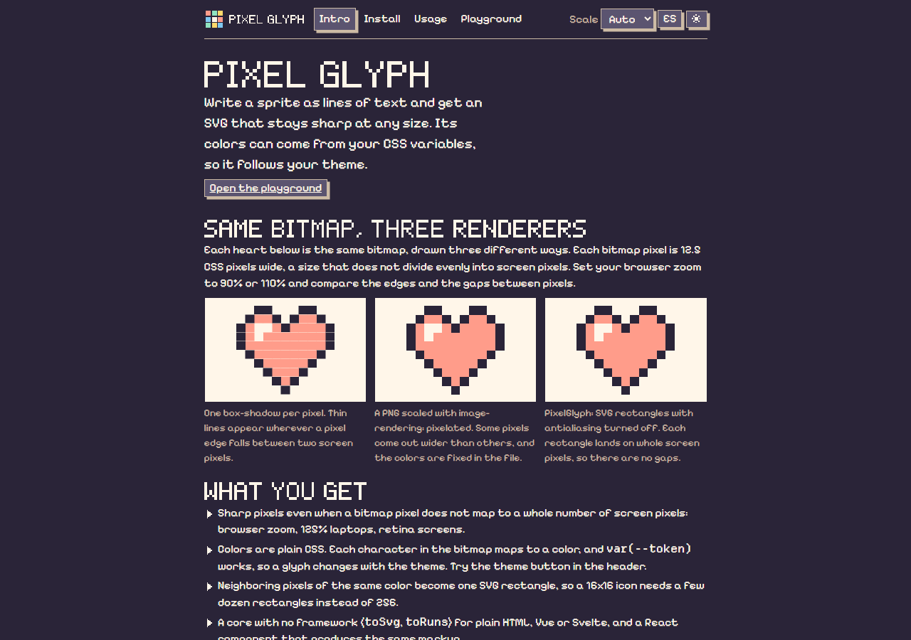
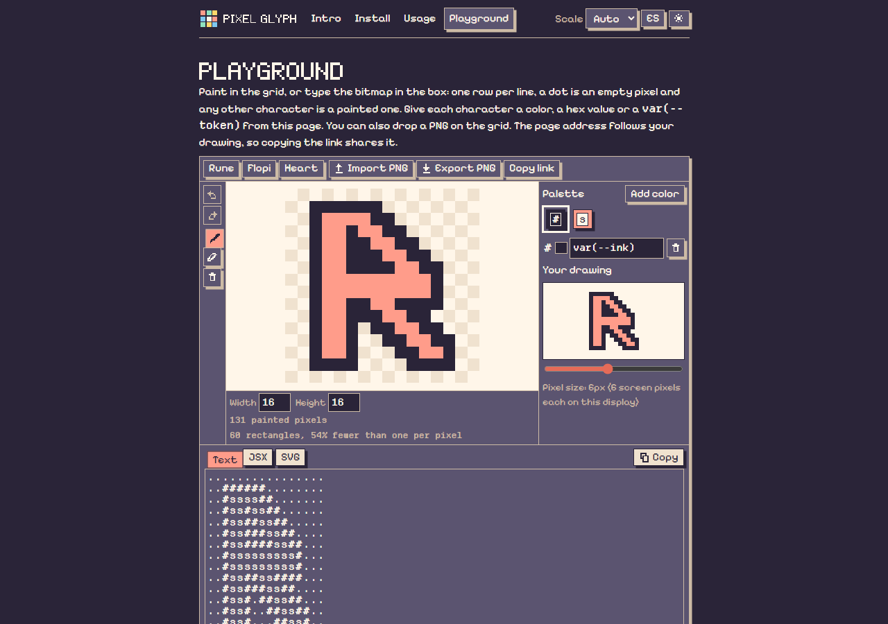
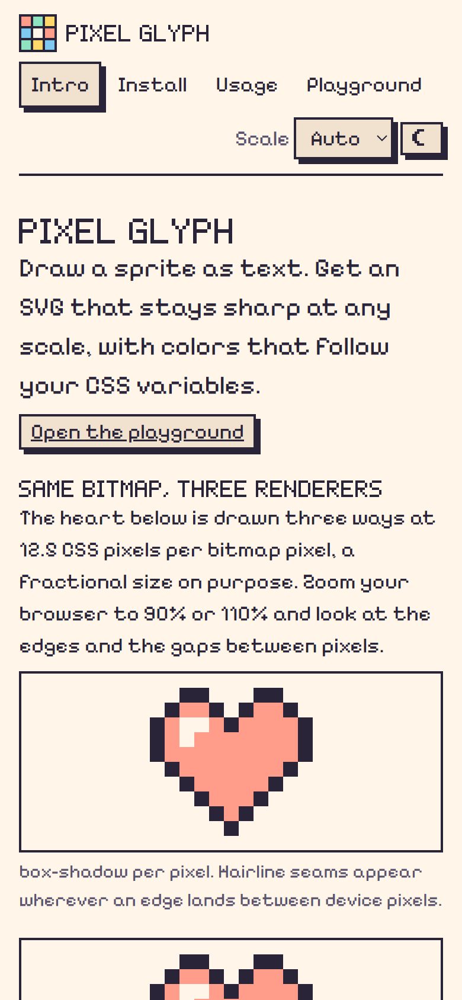

# @kreeptales/pixel-glyph

Crisp pixel art from bitmap strings. Draw a sprite as text, get an SVG that
stays sharp at any scale, including fractional ones, with colors driven by CSS
variables.

**Docs and playground:** https://kreeptales-pixel-glyph.evilld94.workers.dev/

```ts
const heart = [
  '.##.##.',
  '#######',
  '#######',
  '.#####.',
  '..###..',
  '...#...',
]
```

No dependencies. A framework-free core plus a React component.

## Screenshots

The docs site is built with the library: every graphic on it, titles included,
is a `PixelGlyph`.

| Intro: the same heart as box-shadow, PNG and PixelGlyph | Playground: edit, preview, copy, share |
| --- | --- |
|  |  |



## The problem

Pixel art on the web usually goes one of three ways:

- **PNG with `image-rendering: pixelated`**: blurry or unevenly scaled as soon
  as the device scale is not an integer (browser zoom at 80%, a laptop at 125%).
- **`box-shadow` per pixel**: hairline seams between pixels at fractional
  scales, and one shadow per pixel.
- **Icon fonts or hand-written SVG paths**: not pixel art anymore, and colors
  are baked in.

This library renders the bitmap as an SVG of rectangles, one per horizontal run
of same-colored pixels, with `shape-rendering: crispEdges`. Antialiasing is
off, so every rect snaps to whole device pixels: no seams, no blur, the way a
pixel game scales its sprites. Fills are set through `style`, so a palette can
be `var(--ink)` and the glyph follows your theme.

## Install

```bash
npm install @kreeptales/pixel-glyph
```

React is an optional peer dependency (18 or newer), needed only for the
`/react` entry.

## Usage

### React

```tsx
import { PixelGlyph } from '@kreeptales/pixel-glyph/react'

const palette = { '#': 'var(--ink)', r: '#e07a5f' }
const cross = ['.#.', '#r#', '.#.']

<PixelGlyph bitmap={cross} palette={palette} unit={4} label="Close" />
```

Props:

| Prop        | Type                        | Default | Notes                                                        |
| ----------- | --------------------------- | ------- | ------------------------------------------------------------ |
| `bitmap`    | `readonly string[]`         |         | One string per row, one character per pixel, `.` is transparent. |
| `palette`   | `Record<string, string>`    |         | Character to CSS color. Characters not in the palette are skipped. |
| `unit`      | `number \| string`          | `1`     | Size of one pixel. A number is px; a string is used as written, e.g. `"var(--px)"`. |
| `label`     | `string`                    |         | When set, the SVG is `role="img"` with this name and a `<title>`. Otherwise it is `aria-hidden`. |
| `className` | `string`                    |         |                                                              |
| `style`     | `CSSProperties`             |         | Merged after the base styles, so it can override them.       |

### Core (plain HTML, Vue, Svelte, server side)

```ts
import { toSvg } from '@kreeptales/pixel-glyph'

element.innerHTML = toSvg(cross, palette, { unit: 4, label: 'Close' })
```

`toSvg` returns the same markup the React component renders, as a string.
`toRuns(bitmap, palette)` gives you the runs if you want to draw them yourself
(canvas, another framework), and `bitmapSize(bitmap)` returns `{ cols, rows }`.

### Scaling with a CSS variable

Pass a string `unit` and the glyph is sized with `calc(cols * unit)`, so the
whole UI can share one pixel size:

```css
:root { --px: 2px; }
@media (max-width: 1400px) { :root { --px: 1.75px; } }
```

```tsx
<PixelGlyph bitmap={icon} palette={palette} unit="var(--px)" />
```

To scale one glyph differently, set the variable on it through `className`
or `style`: the `calc` resolves against the SVG's own `--px`.

### Palettes as CSS variables

Palette values are any CSS color, and they are applied through `style`, so
`var(--token)` works. Change the variables and the glyph changes with the
theme; the bitmap never does.

## Notes

- The SVG is `display: inline-block` with default (baseline) vertical
  alignment, so it sits in text and inside buttons exactly like an inline
  image. `overflow: visible` lets rects wider than the box show, useful for
  sprite overlays (a hat wider than the head).
- Ragged bitmaps are accepted: the width is the longest row.
- Adjacent same-colored pixels collapse into one rect, so a 16x16 icon is
  typically 20 to 40 rects, not 256.

## Built with pixel-glyph

- [RunenBow](https://runenbow.com/), a portfolio shaped like a retro desktop
  OS. Its icons, logo, cursors and mascot are bitmaps rendered by this library,
  which was extracted from it.
- [The docs site](https://kreeptales-pixel-glyph.evilld94.workers.dev/) of this
  package: logo, icons, page titles (a 5x7 bitmap font) and the mascot.

## Development

```bash
npm test          # vitest
npm run lint      # oxlint
npm run build     # dist/ (ES modules + declarations)
npm run site:dev  # docs site with the playground, served from src/
bash scripts/screenshots.sh   # refresh docs/screenshots from the deployed site
```

## License

MIT
